## Method

### Data Sets

We compared the clinical characteristics of the patients using an independent sample $t$ test, Mann-Whitney $U$ test, or $\chi^2$ test, where appropriate. Table 1 showed the baseline clinical characteristics of patients in the our cohort respectively. 

【替换成你自己的stats.csv文件】

	feature_name	train-label=ALL	train-label=0	train-label=1	pvalue	test-label=ALL	test-label=0	test-label=1	pvalue
0	age	40.68±6.74	42.10±6.41	38.92±6.76	<0.001	43.31±8.14	45.65±5.97	40.55±9.55	0.003
1	nipple_discharge	0.07±0.26	0.10±0.29	0.05±0.21	0.154	0.02±0.14	0.00±0.00	0.05±0.21	0.296
2	long	2.53±1.26	2.13±1.18	3.03±1.20	<0.001	2.62±1.73	2.60±2.06	2.64±1.29	0.325
3	short	1.40±0.71	1.28±0.65	1.56±0.75	0.004	1.55±0.95	1.62±1.06	1.46±0.82	0.959
0	Inflammatory_indicators				0.676				0.881
1	0	176(93.12)	99(94.29)	77(91.67)		45(93.75)	25(96.15)	20(90.91)	
2	1	13(6.88)	6(5.71)	7(8.33)		3(6.25)	1(3.85)	2(9.09)	
3	breast_pain				0.393				0.274
4	0	168(88.89)	91(86.67)	77(91.67)		42(87.50)	21(80.77)	21(95.45)	
5	1	21(11.11)	14(13.33)	7(8.33)		6(12.50)	5(19.23)	1(4.55)	
6	skin_lesions				1.0				0.178
7	0	176(93.12)	98(93.33)	78(92.86)		45(93.75)	26(100.00)	19(86.36)	
8	1	13(6.88)	7(6.67)	6(7.14)		3(6.25)	null	3(13.64)	
9	margin				0.394				0.604
10	1	145(76.72)	81(77.14)	64(76.19)		36(75.00)	18(69.23)	18(81.82)	
11	2	14(7.41)	5(4.76)	9(10.71)		3(6.25)	2(7.69)	1(4.55)	
12	3	27(14.29)	17(16.19)	10(11.90)		9(18.75)	6(23.08)	3(13.64)	
13	4	3(1.59)	2(1.90)	1(1.19)		0(0.00)	null	null	
14	angular				0.142				0.092
15	0	166(87.83)	96(91.43)	70(83.33)		40(83.33)	19(73.08)	21(95.45)	
16	1	23(12.17)	9(8.57)	14(16.67)		8(16.67)	7(26.92)	1(4.55)	
17	echogenic_foci				0.75				1.0
18	0	71(37.57)	41(39.05)	30(35.71)		24(50.00)	13(50.00)	11(50.00)	
19	1	118(62.43)	64(60.95)	54(64.29)		24(50.00)	13(50.00)	11(50.00)	
20	Blood_flow				0.512				0.701
21	0	2(1.06)	1(0.95)	1(1.19)		1(2.08)	null	1(4.55)	
22	1	117(61.90)	70(66.67)	47(55.95)		30(62.50)	16(61.54)	14(63.64)	
23	2	24(12.70)	12(11.43)	12(14.29)		8(16.67)	5(19.23)	3(13.64)	
24	3	46(24.34)	22(20.95)	24(28.57)		9(18.75)	5(19.23)	4(18.18)	


Table 1 Baseline characteristics of patients in cohorts.

### Feature Extraction

The handcrafted features can be divided into three groups: (I) geometry, (II) intensity and (III) texture. The geometry features describe the three-dimensional shape characteristics of the tumor. The intensity features describe the first-order statistical distribution of the voxel intensities within the tumor. The texture features describe the patterns, or the second- and high-order spatial distributions of the intensities. Here the texture features are extracted using several different methods, including the gray-level co-occurrence matrix (GLCM), gray-level run length matrix (GLRLM), gray level size zone matrix (GLSZM) and neighborhood gray-tone difference matrix (NGTDM) methods. 

### Feature Selection

**Statistics**: We also conducted Mann-Whitney Utest statistical test and feature screening for all radiomic features. Only the pvalue<0.05 of radiomic feature were kept.

**Correlation**: For features with high repeatability, Spearman's rank correlation coefficient was also used to calculate the correlation between features (Fig. 1. spearman correlation of each feature), and one of the features with correlation coefficient greater than 0.9 between any two features is retained. In order to retain the ability to depict features to the greatest extent, we use greedy recursive deletion strategy for feature filtering, that is, the feature with the greatest redundancy in the current set is deleted each time. After this, 23 features were finally kept.

**Lasso**:The least absolute shrinkage and selection operator (LASSO) regression model was used on the discovery data set for signature construction. Depending on the regulation weight *λ*, LASSO shrinks all regression coefficients towards zero and sets the coefficients of many irrelevant features exactly to zero. To find an optimal *λ*, 10-fold cross validation with minimum criteria was employed, where the final value of *λ* yielded minimum cross validation error.  The retained features with nonzero coefficients were used for regression model fitting and combined into a radiomics signature. Subsequently, we obtained a radiomics score for each patient by a linear combination of retained features weighed by their model coefficients. The Python scikit-learn package was used for LASSO regression modeling. 

### Rad Signature

After Lasso feature screening, we input the final features into the machine learning models like lr, svm, random forest, XGBoost and so on for risk model construction. Here, we adopt 5 fold cross verification to obtain the final Rad Signature.

Furthermore, to intuitively and efficiently assess the incremental prognostic value of the radiomics signature to the clinical risk factors, a radiomics nomogram was presented on the validation data set. The nomogram combined the radiomics signature and the clinical risk factors based on the logistic regression analysis. To compare the agreement between the 【任务】 prediction of the nomogram and the actual observation, the calibration curve was calculated.

### Clinical Signature

The building process of clinical signature is almost the same as rad signature. First the features used for building clinical signature were selected by baseline statistic whose pvalue<0.05. We also used the same machine learning model in rad signature building process. 5 fold cross validation and test cohort  was set to be fixed for fair comparation.

### Radiomic Nomogram

Radiomic nomogram was established in combination with radiomic signature and clinical signature. The diagnostic efficacy of radiomic nomogram was tested in test cohort, ROC curves were drawn to evaluate the diagnostic efficacy of nomogram. The calibration efficiency of nomogram was evaluated by drawing calibration curves, and Hosmer-Lemeshow analytical fit was used to evaluate the calibration ability of nomogram. Mapping decision curve analysis (DCA) to evaluate the clinical utility of predictive models.

## Results

### Signature Building

**Features Statistics**: A total of 6 categories, XXX handcrafted features are extracted, including XXX firstorder features, 14 shape features, and the last are texture features. Details of the handcrafted features can be found in Supplementary Table 1. All handcrafted features are extracted with an in-house feature analysis program implemented in Pyradiomics（http://pyradiomics.readthedocs.io）. Fig. 2 shows all features and corresponding pvalue results.

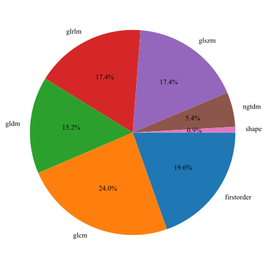

Fig. 1 Numer and ratio of handcrafted features

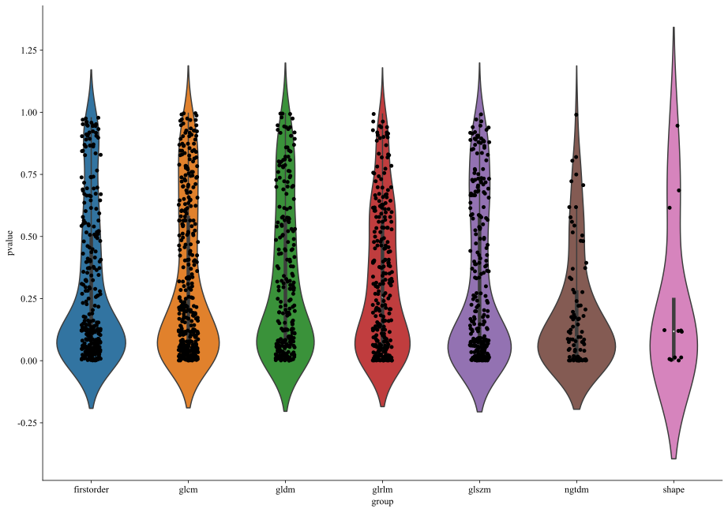

Fig. 2 Statistics of radiomic features

Fig.3 shows the correlations between each clinical features, it is indicate that Long Diameter, Short Diameter and Diameter has maximum correlation coefficient. 

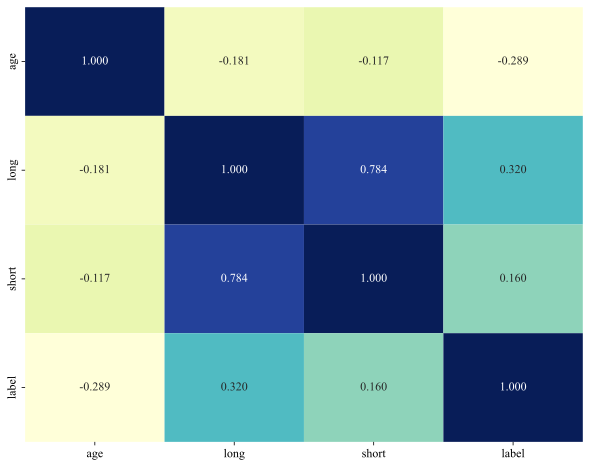

Fig.3 Spearman correlation coefficients of each clinical features 

**Lasso feature selection**: Nonzero coefficients were selected to establish the Rad-score with a least absolute shrinkage and selection operator (LASSO) logistic regression model. Coefficients and MSE(mean standard error) of 10 folds validation is show in Fig.4 and Fig.5

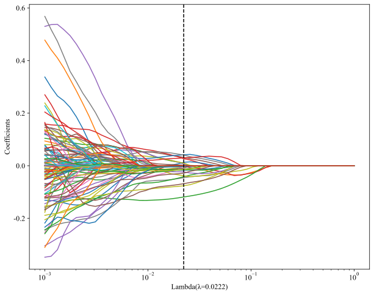

Fig.4. Coefficients of 10 fold cross validation

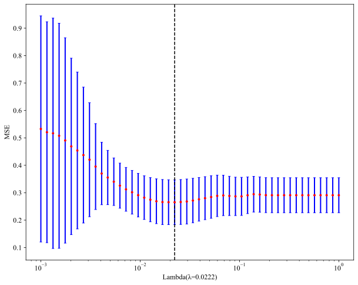

Fig.5 MSE of 10 fold cross validation

Rad score is show as follow, Fig.6 shows the coefficients value in the final selected none zero features.

【替换成自己的】

```
label = 0.3090601683388831 + +0.127998 * original_firstorder_Kurtosis -0.077429 * original_firstorder_Minimum +0.114108 * original_firstorder_RootMeanSquared -0.047303 * original_glcm_Imc2 -0.063017 * original_glcm_SumEntropy +0.064179 * original_glrlm_LongRunLowGrayLevelEmphasis -0.059840 * original_glrlm_RunEntropy -0.031554 * original_glrlm_ShortRunEmphasis -0.016628 * original_glszm_GrayLevelVariance +0.008884 * original_glszm_ZoneVariance +0.053577 * original_ngtdm_Busyness -0.029125 * original_shape_Sphericity
```

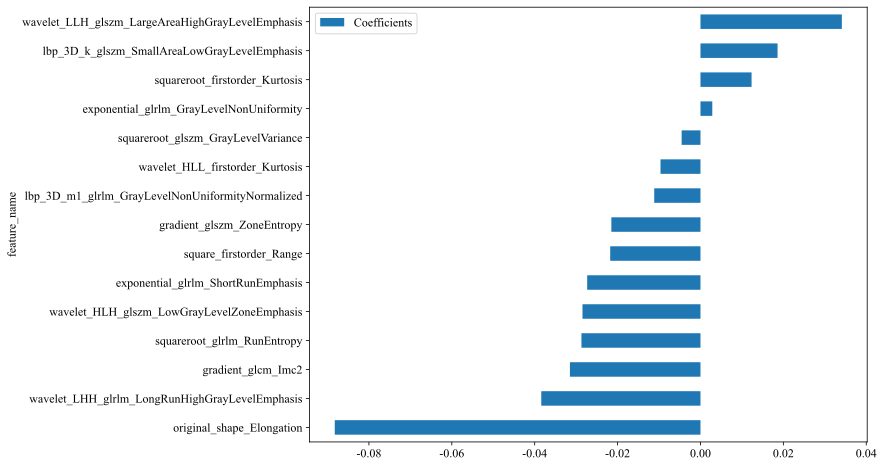

Fig.6. The histogram of the Rad-score based on the selected features. 

**Model Comparation**: Table 2. is all model we used to predict 【任务】, XXX model preforms the best performance. So in the building of clinical signature, XXX is selected as base model.


model_name	Accuracy	AUC	95% CI	Sensitivity	Specificity	PPV	NPV	Precision	Recall	F1	Threshold	Task
0	RandomForest	0.836	0.912	0.8728 - 0.9504	0.857	0.819	0.791	0.878	0.791	0.857	0.823	0.422	label-train
1	RandomForest	0.750	0.787	0.6559 - 0.9175	0.818	0.692	0.692	0.818	0.692	0.818	0.750	0.423	label-test
2	ExtraTrees	0.767	0.856	0.8036 - 0.9087	0.857	0.695	0.692	0.859	0.692	0.857	0.766	0.424	label-train
3	ExtraTrees	0.688	0.736	0.5946 - 0.8774	0.636	0.731	0.667	0.704	0.667	0.636	0.651	0.448	label-test
4	LightGBM	0.878	0.930	0.8945 - 0.9662	0.893	0.867	0.843	0.910	0.843	0.893	0.867	0.449	label-train
5	LightGBM	0.708	0.810	0.6887 - 0.9319	0.818	0.615	0.643	0.800	0.643	0.818	0.720	0.407	label-test


The optimal model was obtained by using rad features compared with an LR, SVM, KNN, Decision Tree, Random Forest, Extra Trees, XGBoost and LightGBM classifier. XGBoost achieved the best value of auc on the training and test cohort reached yyy and yyy for 【任务】 respectively.  Fig.7 shows each rad signature model's auc on test cohort.


Fig. 7 ROC analysis of different models on rad signature

Table 3 shows the performance of each model on clinical signature, Fig.8 shows each clinical signature model's auc on test cohort

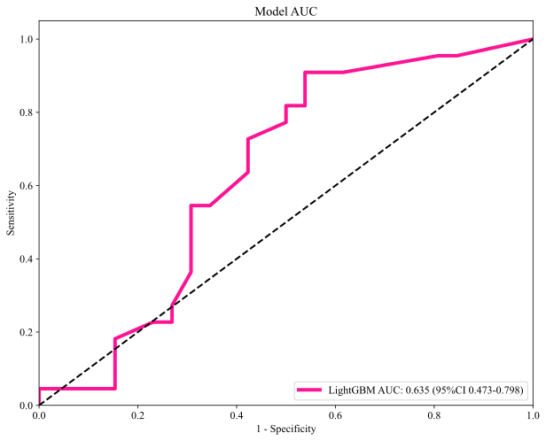

Fig. 8 ROC analysis of different models on rad signature

### Nomgram

**AUC**: In training cohort both clinical signature and rad signature get the prefect fitting. In test cohort clinical signature seems over fitting, but rag signature still fitted good. The Nomogram using Logistic Regression algorithm was preformed to combine clinical signature and rad signature, which shows the best performance. In order to compare the clinical signature and rad signature and nomogram, Delong test was used. 

Signature	Accuracy	AUC	95% CI	Sensitivity	Specificity	PPV	NPV	Precision	Recall	F1	Threshold	Cohort
0	Clinic Signature	0.725	0.818	0.7591 - 0.8765	0.833	0.638	0.648	0.827	0.648	0.833	0.729	0.413	Train
1	Rad Signature	0.878	0.930	0.8945 - 0.9662	0.893	0.867	0.843	0.910	0.843	0.893	0.867	0.449	Train
2	Nomogram	0.873	0.935	0.9019 - 0.9688	0.821	0.914	0.885	0.865	0.885	0.821	0.852	0.493	Train


Nomogram Vs Clinic	Nomogram Vs Rad	cohort
0	8.863e-07	0.620	Train
1	6.823e-03	0.603	Test


Table3. Nomogram indicators.

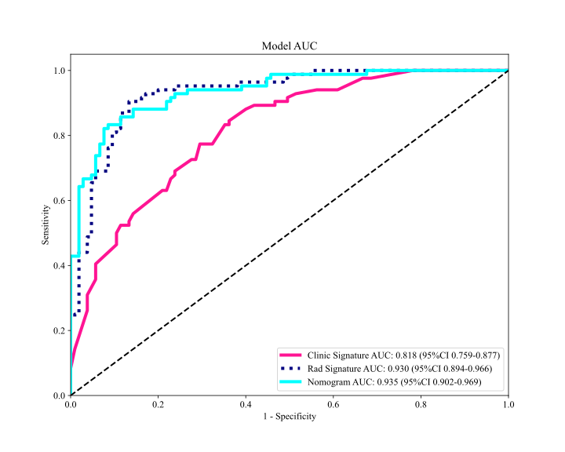

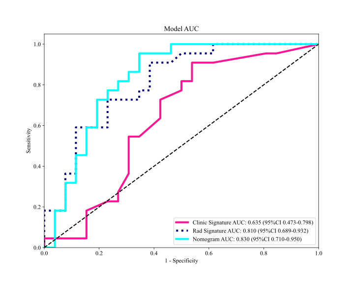

Fig.9 show the AUC in both train and test cohort.

**Calibration Curves**: Nomogram calibration curves show good agreement between predicted and observed 【任务】 training and test cohort. The P values of Hosmer-Lemeshow test inspect of clinical signature, rad signature and nomogram. This shows that Nomogram fits perfectly in both the training and test cohort. Fig.10 shows the calibration curves in train and test cohort.

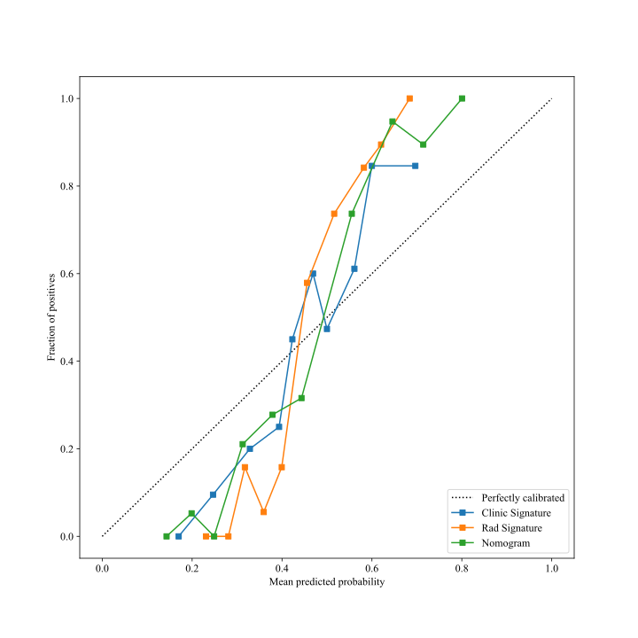

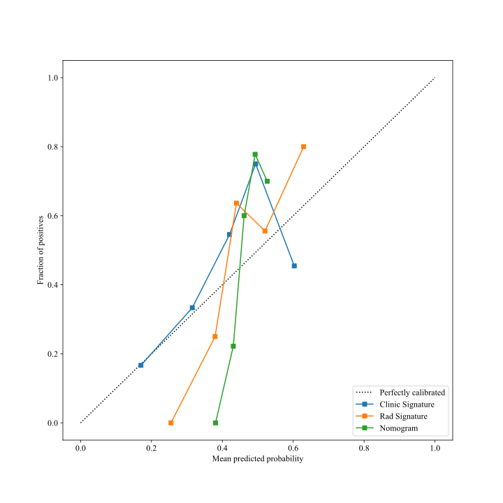

|      | Clinic Signature | Rad Signature | Nomogram |
| ---: | ---------------: | ------------: | -------: |
|    0 |         0.802715 |      0.646688 | 0.318583 |
|    1 |         0.160125 |      0.550619 | 0.124834 |

Fig.10 The calibration curves in train and test cohort, Hosmer-Lemeshow test.

**DCA**: In this study, we also evaluated each model through DCA. The decision curve analysis for the clinical signature, rad signature and radiomic nomogram are presented in Fig. 11. Compared with scenarios in which no prediction model would be used (ie, treat-all or treat-none scheme), radiomic nomogram showed significant benefit for intervention in patients with a prediction probability compared to clinical signature, rad signature. Nomogram is higher than other signatures. Preoperative prediction 【任务】 using radiomic nomogram has been shown to have better clinical benefit.

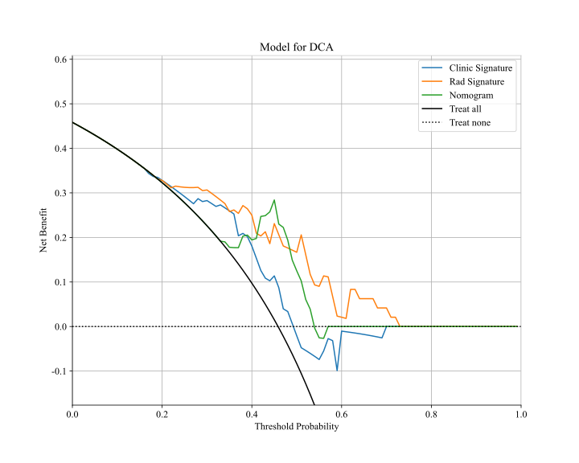

Fig. 11 Decision curve of in test cohort

**Interpretation**: Fig.12 shows the nomogram for clinical use.

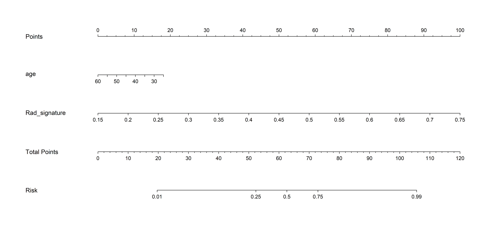

